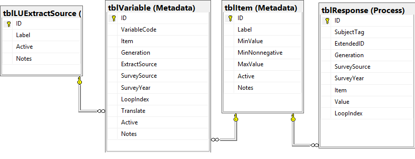
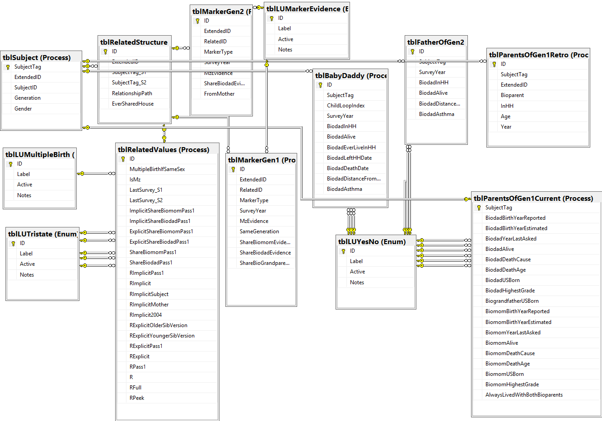
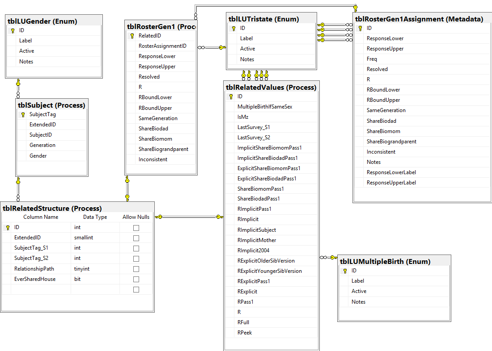
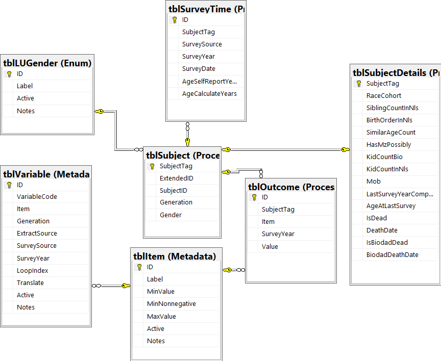

# nlsy-links-determination-2017
Manipulation of the NLSY information to infer kinship relationships

This repository contains the products from our current grant (that started in 2017). Products from our 2011-2015 grant are contained in https://github.com/LiveOak/nlsy-links-determination-2011. See also the [NlsyLinks](https://github.com/LiveOak/NlsyLinks) R package.

## Personnel
* [Joe Rodgers](https://www.vanderbilt.edu/psychological_sciences/bio/joe-rodgers), P.I.
* [David Bard](http://ouhsc.edu/bbmc/team/)
* [Will Beasley](https://scholar.google.com/citations?user=ffsJTC0AAAAJ)
* [Mike Hunter](http://ouhsc.edu/bbmc/team/)
* [S. Mason Garrison](https://www.smasongarrison.com/)
* See the article "[The NLSY Kinship Links: Using the NLSY79 and NLSY-Children Data to Conduct Genetically-Informed and Family-Oriented Research](https://link.springer.com/article/10.1007/s10519-016-9785-3)" for personnel in all previous Rodgers/Rowe BG grants.

## Database Structure

Tables related to an *Item*:

Tables related to an *Marker*:

Tables related to an *Relationship*:

Tables related to an *Subject*:

Additional Information:
1. Some metadata sets are described in CSVs (*i.e.*, [79](data-public/metadata/tables-79) and [97](data-public/metadata/tables-97)).  The metadata tables are [uploaded to the database](dal/) and [logged](stitched-output/dal/).
1. Other metadata sets that are hardcoded into the C#:
    * [79 Enums](Base79/Enums.cs)
    * [79 EnumResponses](Base79/EnumResponses.cs)
    * [79 EnumResponsesGen1](Base79/EnumResponsesGen1.cs)
    * [79 EnumResponsesGen2](Base79/EnumResponsesGen2.cs)
1. Row & columns counts for each table are [available](analysis/eda/counts/counts.md) and [tracked over time](https://github.com/LiveOak/nlsy-links-determination-2017/commits/master/analysis/eda/counts/counts.md).
1. For the masochistically curious, the SQL scripts for the full [79](data-public/metadata/database/generate-db-79.sql) and [97](data-public/metadata/database/generate-db-97.sql) databases are available.

## Aims
>This application requests funds to continue our past NLSY kinship linking efforts, and to use recently-developed kinship links in new and innovative empirical research.  With previous support from a recent NIH grant, we updated kinship links for two National Longitudinal Survey of Youth datasets (NLSY79 and NLSY-Children/Young Adults), completed in 2013.  The proposed research will identify and circulate links for a third NLSY dataset, the NLSY97, and will provide data for four proposed studies that use the kinship link structure from all three datasets.
>
>Our specific aims emerge from the structure built into the three NLSY datasets.  The NLSY79 data, first collected in 1979 through a household probability sample of 14-21 year old U.S. adolescents(aged 49-57 in the 2014 release), represents a longitudinal database collected annually (early) and biennially (more recently) for 35 years.  The NLSYC contains longitudinal data from all biological children born to the NLSY79 females (for whom childbearing is now complete), collected biennially since 1986, with an age range in 2014 from infancy to the early 40’s.  The NLSY97 is an 18-year approximate replication of the NLSY79, with annual surveys from 1997 to 2012, then biennially from 2012 and continuing.  Each data source has thousands of outcome variables related to work, family, health, cognition, and education.  These NLSY data structures allow researchers to study: 1) Longitudinal patterns within a dataset; 2) Cross-generational patterns across NLSY79 and NLSYC; 3) Cohort/period changes across NLSY79 and NLSY97; 4) Within-family patterns; 5) Cross-dataset outcomes using innovative research designs.  Thousands of research teams from many disciplines have conducted research using the NLSY data.  The data become even more valuable, and support more focused (behavior genetic) research, with their biometrical properties identified.
>
>Through three previous funded projects, our research team has created and circulated high-quality kinship links (including validity analyses, and online software vignettes) for the NLSY79 and NLSYC, for thousands of respondents who share a household (the master combined dataset includes 42,774 kinship pairs).  Around 60 research papers and dissertations/theses have been produced using NLSY79 and NLSYC links.  However, kinship links using sophisticated and modern linking methods have never been developed for the NLSY97 (which has 1,862 households with multiple respondents, and 4,027 respondents in those households).  Our first specific aim is to further expand family/kinship information in three NLSY datasets to support researchers (including our own research team) to take advantage of many valuable within-family features.  We will create twin, sibling, and half-sibling links for the NLSY97, and archive those with existing NLSY79 and NLSY-Children links.  We will validate the new links, and create matches from NLSY97 into the NLSY79 and NLSYC datasets (the matching links also will be publicly available to other research teams).  Further, we will develop additional vignettes for illustration and software support, offered through a broad set of platforms.  We will create minor updates for the previous NLSY79 and NLSYC links.  And we will continue to run a User Service Office to support research use of the links.
>
>Our second aim involves using the new links from the three datasets in two lines of biometrical NLSY research.  The first is a set of two fertility studies that include:  1) A new “proxy mother” design, including “virtual siblings” (NLSY97 respondents matched to NLSYC/YA respondents using propensity score analysis) which leverages features of the connections across the three datasets, applied to fertility outcomes; 2) A design developed to biometrically decompose the relationship of childbearing to health outcomes, using fertility histories and the health modules collected at age 40 and 50.  The second study uses cognitive outcomes in two studies: 1) Using six different cognitive measures and all 45,000+ kinship links across the three datasets, we will evaluate and elaborate the changing heritability patterns across age during childhood and adolescence; 2) Using the NLS79 and NLSYC, we will evaluate biometrically the link between SES and cognitive ability, with health outcomes used to moderate the relationship to health, using as health measures the health batteries noted above.
>
>The NLSY kinship links have potential to provide research support for hundreds of researchers within an interdisciplinary research community studying behavior genetics, demography, developmental psychology, aging, economics, criminology, medical outcomes, and family studies.  The general aims of our proposed research are to support this broad research community, and to contributes original research from our own research team.
