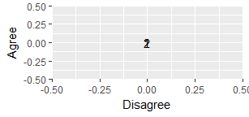

This report covers the analyses used in development of the NLSY Behavior Genetics kinship links ([Joseph Rodgers](https://www.vanderbilt.edu/psychological_sciences/bio/joe-rodgers), PI).

<!--  Set the working directory to the repository's base directory; this assumes the report is nested inside of two directories.-->


<!-- Set the report-wide options, and point to the external code file. -->


<!-- Load 'sourced' R files.  Suppress the output when loading sources. -->


<!-- Load packages, or at least verify they're available on the local machine.  Suppress the output when loading packages. -->


<!-- Load any global functions and variables declared in the R file.  Suppress the output. -->


<!-- Declare any global functions specific to a Rmd output.  Suppress the output. -->


<!-- Load the datasets.   -->


<!-- Tweak the datasets.   -->


# Summary {.tabset .tabset-fade .tabset-pills}

## Notes
1. The current report compares the versions of the NLSY97 Links
    * Version 2: account for twins.
    * Version 3: same sib full twins are R=.5 by default, and overridden if explicitly MZ.

# Comparison of Agreement
<!-- -->

# Table of *R* Assignments
<table class="table table-striped table-hover table-condensed table-responsive" style="width: auto !important; ">
<caption>Counts for 97 Housemates</caption>
 <thead>
  <tr>
   <th style="text-align:left;"> R </th>
   <th style="text-align:right;"> Implicit </th>
   <th style="text-align:right;"> Explicit </th>
   <th style="text-align:right;"> Roster </th>
   <th style="text-align:right;"> Eventual </th>
  </tr>
 </thead>
<tbody>
  <tr>
   <td style="text-align:left;"> -- </td>
   <td style="text-align:right;"> 2,519 </td>
   <td style="text-align:right;"> 2,519 </td>
   <td style="text-align:right;"> 108 </td>
   <td style="text-align:right;"> 0 </td>
  </tr>
  <tr>
   <td style="text-align:left;"> 0.000 </td>
   <td style="text-align:right;"> -- </td>
   <td style="text-align:right;"> -- </td>
   <td style="text-align:right;"> 174 </td>
   <td style="text-align:right;"> 1,318 </td>
  </tr>
  <tr>
   <td style="text-align:left;"> 0.250 </td>
   <td style="text-align:right;"> -- </td>
   <td style="text-align:right;"> -- </td>
   <td style="text-align:right;"> 126 </td>
   <td style="text-align:right;"> 124 </td>
  </tr>
  <tr>
   <td style="text-align:left;"> 0.500 </td>
   <td style="text-align:right;"> -- </td>
   <td style="text-align:right;"> -- </td>
   <td style="text-align:right;"> 2,111 </td>
   <td style="text-align:right;"> 1,049 </td>
  </tr>
  <tr>
   <td style="text-align:left;"> 1.000 </td>
   <td style="text-align:right;"> -- </td>
   <td style="text-align:right;"> -- </td>
   <td style="text-align:right;"> -- </td>
   <td style="text-align:right;"> 28 </td>
  </tr>
</tbody>
</table>

<table class="table table-striped table-hover table-condensed table-responsive" style="width: auto !important; ">
<caption>Counts for 97 Housemates (Previous version of links)</caption>
 <thead>
  <tr>
   <th style="text-align:left;"> R </th>
   <th style="text-align:right;"> Implicit </th>
   <th style="text-align:right;"> Explicit </th>
   <th style="text-align:right;"> Roster </th>
   <th style="text-align:right;"> Eventual </th>
  </tr>
 </thead>
<tbody>
  <tr>
   <td style="text-align:left;"> -- </td>
   <td style="text-align:right;"> 2,519 </td>
   <td style="text-align:right;"> 2,519 </td>
   <td style="text-align:right;"> 1,202 </td>
   <td style="text-align:right;"> 0 </td>
  </tr>
  <tr>
   <td style="text-align:left;"> 0.000 </td>
   <td style="text-align:right;"> -- </td>
   <td style="text-align:right;"> -- </td>
   <td style="text-align:right;"> 174 </td>
   <td style="text-align:right;"> 1,318 </td>
  </tr>
  <tr>
   <td style="text-align:left;"> 0.250 </td>
   <td style="text-align:right;"> -- </td>
   <td style="text-align:right;"> -- </td>
   <td style="text-align:right;"> 126 </td>
   <td style="text-align:right;"> 124 </td>
  </tr>
  <tr>
   <td style="text-align:left;"> 0.500 </td>
   <td style="text-align:right;"> -- </td>
   <td style="text-align:right;"> -- </td>
   <td style="text-align:right;"> 1,017 </td>
   <td style="text-align:right;"> 1,049 </td>
  </tr>
  <tr>
   <td style="text-align:left;"> 1.000 </td>
   <td style="text-align:right;"> -- </td>
   <td style="text-align:right;"> -- </td>
   <td style="text-align:right;"> -- </td>
   <td style="text-align:right;"> 28 </td>
  </tr>
</tbody>
</table>

# Breakdown of Agreements 
<table class="table table-striped table-hover table-condensed table-responsive" style="width: auto !important; ">
<caption>Joint Frequencies for 97 Housemates</caption>
 <thead>
  <tr>
   <th style="text-align:right;"> count current </th>
   <th style="text-align:right;"> RImplicit </th>
   <th style="text-align:right;"> RExplicit </th>
   <th style="text-align:right;"> RRoster </th>
   <th style="text-align:right;"> Delta </th>
  </tr>
 </thead>
<tbody>
  <tr>
   <td style="text-align:right;background-color: #a6e8a1;"> 2,111 </td>
   <td style="text-align:right;background-color: #a6e8a1;"> -- </td>
   <td style="text-align:right;background-color: #a6e8a1;"> -- </td>
   <td style="text-align:right;background-color: #a6e8a1;"> 0.500 </td>
   <td style="text-align:right;background-color: #a6e8a1;"> 1094 </td>
  </tr>
  <tr>
   <td style="text-align:right;background-color: #a6e8a1;"> 174 </td>
   <td style="text-align:right;background-color: #a6e8a1;"> -- </td>
   <td style="text-align:right;background-color: #a6e8a1;"> -- </td>
   <td style="text-align:right;background-color: #a6e8a1;"> 0.000 </td>
   <td style="text-align:right;background-color: #a6e8a1;"> 0 </td>
  </tr>
  <tr>
   <td style="text-align:right;background-color: #a6e8a1;"> 126 </td>
   <td style="text-align:right;background-color: #a6e8a1;"> -- </td>
   <td style="text-align:right;background-color: #a6e8a1;"> -- </td>
   <td style="text-align:right;background-color: #a6e8a1;"> 0.250 </td>
   <td style="text-align:right;background-color: #a6e8a1;"> 0 </td>
  </tr>
  <tr>
   <td style="text-align:right;background-color: #a6e8a1;"> 108 </td>
   <td style="text-align:right;background-color: #a6e8a1;"> -- </td>
   <td style="text-align:right;background-color: #a6e8a1;"> -- </td>
   <td style="text-align:right;background-color: #a6e8a1;"> -- </td>
   <td style="text-align:right;background-color: #a6e8a1;"> -1094 </td>
  </tr>
</tbody>
</table>


# Session Information
For the sake of documentation and reproducibility, the current report was rendered in the following environment.  Click the line below to expand.

<details>
  <summary>Environment <span class="glyphicon glyphicon-plus-sign"></span></summary>

```
Session info --------------------------------------------------------------------------------------
```

```
 setting  value                                      
 version  R version 3.4.3 Patched (2018-01-25 r74163)
 system   x86_64, mingw32                            
 ui       RStudio (1.1.393)                          
 language (EN)                                       
 collate  English_United States.1252                 
 tz       America/Chicago                            
 date     2018-02-16                                 
```

```
Packages ------------------------------------------------------------------------------------------
```

```
 package     * version    date       source                               
 assertthat    0.2.0      2017-04-11 CRAN (R 3.4.2)                       
 backports     1.1.2      2017-12-13 CRAN (R 3.4.3)                       
 base        * 3.4.3      2018-01-26 local                                
 bindr         0.1        2016-11-13 CRAN (R 3.4.2)                       
 bindrcpp    * 0.2        2017-06-17 CRAN (R 3.4.2)                       
 bit           1.1-12     2014-04-09 CRAN (R 3.4.1)                       
 bit64         0.9-7      2017-05-08 CRAN (R 3.4.1)                       
 bitops      * 1.0-6      2013-08-17 CRAN (R 3.4.1)                       
 blob          1.1.0      2017-06-17 CRAN (R 3.4.2)                       
 checkmate     1.8.5      2017-10-24 CRAN (R 3.4.2)                       
 chron         2.3-52     2018-01-06 CRAN (R 3.4.3)                       
 cli           1.0.0      2017-11-05 CRAN (R 3.4.2)                       
 colorspace    1.3-2      2016-12-14 CRAN (R 3.4.2)                       
 compiler      3.4.3      2018-01-26 local                                
 config        0.2        2016-08-02 CRAN (R 3.4.2)                       
 crayon        1.3.4      2017-09-16 CRAN (R 3.4.1)                       
 datasets    * 3.4.3      2018-01-26 local                                
 DBI         * 0.7        2017-06-18 CRAN (R 3.4.2)                       
 devtools      1.13.4     2017-11-09 CRAN (R 3.4.2)                       
 digest        0.6.15     2018-01-28 CRAN (R 3.4.3)                       
 dplyr         0.7.4.9000 2018-01-26 Github (tidyverse/dplyr@3f91e1e)     
 evaluate      0.10.1     2017-06-24 CRAN (R 3.4.2)                       
 ggplot2     * 2.2.1.9000 2017-12-20 Github (tidyverse/ggplot2@bfff1d8)   
 glue          1.2.0      2017-10-29 CRAN (R 3.4.2)                       
 graphics    * 3.4.3      2018-01-26 local                                
 grDevices   * 3.4.3      2018-01-26 local                                
 grid          3.4.3      2018-01-26 local                                
 gsubfn        0.6-6      2014-08-27 CRAN (R 3.4.2)                       
 gtable        0.2.0      2016-02-26 CRAN (R 3.4.2)                       
 highr         0.6        2016-05-09 CRAN (R 3.4.2)                       
 hms           0.4.1      2018-01-24 CRAN (R 3.4.3)                       
 htmltools     0.3.6      2017-04-28 CRAN (R 3.4.2)                       
 httr          1.3.1      2017-08-20 CRAN (R 3.4.2)                       
 kableExtra    0.7.0      2018-01-15 CRAN (R 3.4.3)                       
 knitr       * 1.19       2018-01-29 CRAN (R 3.4.3)                       
 labeling      0.3        2014-08-23 CRAN (R 3.4.1)                       
 lazyeval      0.2.1      2017-10-29 CRAN (R 3.4.2)                       
 magrittr    * 1.5        2014-11-22 CRAN (R 3.4.2)                       
 markdown      0.8        2017-04-20 CRAN (R 3.4.2)                       
 memoise       1.1.0      2017-04-21 CRAN (R 3.4.2)                       
 methods     * 3.4.3      2018-01-26 local                                
 munsell       0.4.3      2016-02-13 CRAN (R 3.4.2)                       
 odbc          1.1.5      2018-01-23 CRAN (R 3.4.3)                       
 OuhscMunge    0.1.8.9006 2018-02-14 Github (OuhscBbmc/OuhscMunge@ce0a489)
 pillar        1.1.0      2018-01-14 CRAN (R 3.4.3)                       
 pkgconfig     2.0.1      2017-03-21 CRAN (R 3.4.2)                       
 plyr          1.8.4      2016-06-08 CRAN (R 3.4.2)                       
 proto         1.0.0      2016-10-29 CRAN (R 3.4.2)                       
 purrr         0.2.4      2017-10-18 CRAN (R 3.4.2)                       
 R6            2.2.2      2017-06-17 CRAN (R 3.4.2)                       
 Rcpp          0.12.15    2018-01-20 CRAN (R 3.4.3)                       
 RCurl       * 1.95-4.10  2018-01-04 CRAN (R 3.4.3)                       
 readr         1.1.1      2017-05-16 CRAN (R 3.4.2)                       
 rlang         0.1.6.9003 2018-01-26 Github (tidyverse/rlang@b5da865)     
 rmarkdown     1.8        2017-11-17 CRAN (R 3.4.2)                       
 RODBC         1.3-15     2017-04-13 CRAN (R 3.4.1)                       
 rprojroot     1.3-2      2018-01-03 CRAN (R 3.4.3)                       
 rsconnect     0.8.5      2017-08-23 CRAN (R 3.4.2)                       
 RSQLite     * 2.0        2017-06-19 CRAN (R 3.4.1)                       
 rstudioapi    0.7        2017-09-07 CRAN (R 3.4.1)                       
 rvest         0.3.2      2016-06-17 CRAN (R 3.4.2)                       
 scales        0.5.0.9000 2017-10-11 Github (hadley/scales@d767915)       
 sqldf         0.4-11     2017-06-28 CRAN (R 3.4.2)                       
 stats       * 3.4.3      2018-01-26 local                                
 stringi       1.1.6      2017-11-17 CRAN (R 3.4.2)                       
 stringr       1.2.0      2017-02-18 CRAN (R 3.4.2)                       
 tcltk         3.4.3      2018-01-26 local                                
 testit        0.7.1      2017-12-21 Github (yihui/testit@8a346dd)        
 tibble        1.4.2      2018-01-22 CRAN (R 3.4.3)                       
 tidyr         0.8.0      2018-01-29 CRAN (R 3.4.3)                       
 tidyselect    0.2.3      2017-11-06 CRAN (R 3.4.2)                       
 tools         3.4.3      2018-01-26 local                                
 utf8          1.1.3      2018-01-03 CRAN (R 3.4.3)                       
 utils       * 3.4.3      2018-01-26 local                                
 viridisLite   0.3.0      2018-02-01 CRAN (R 3.4.3)                       
 withr         2.1.1.9000 2017-12-20 Github (jimhester/withr@df18523)     
 xml2          1.2.0      2018-01-24 CRAN (R 3.4.3)                       
 yaml          2.1.16     2017-12-12 CRAN (R 3.4.3)                       
```
</details>


Report rendered by Will at 2018-02-16, 17:11 -0600 in 1 seconds.
